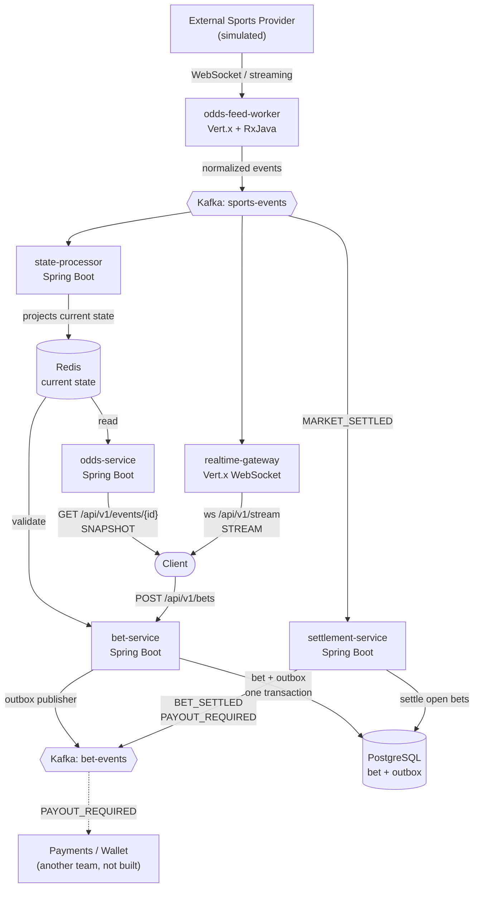
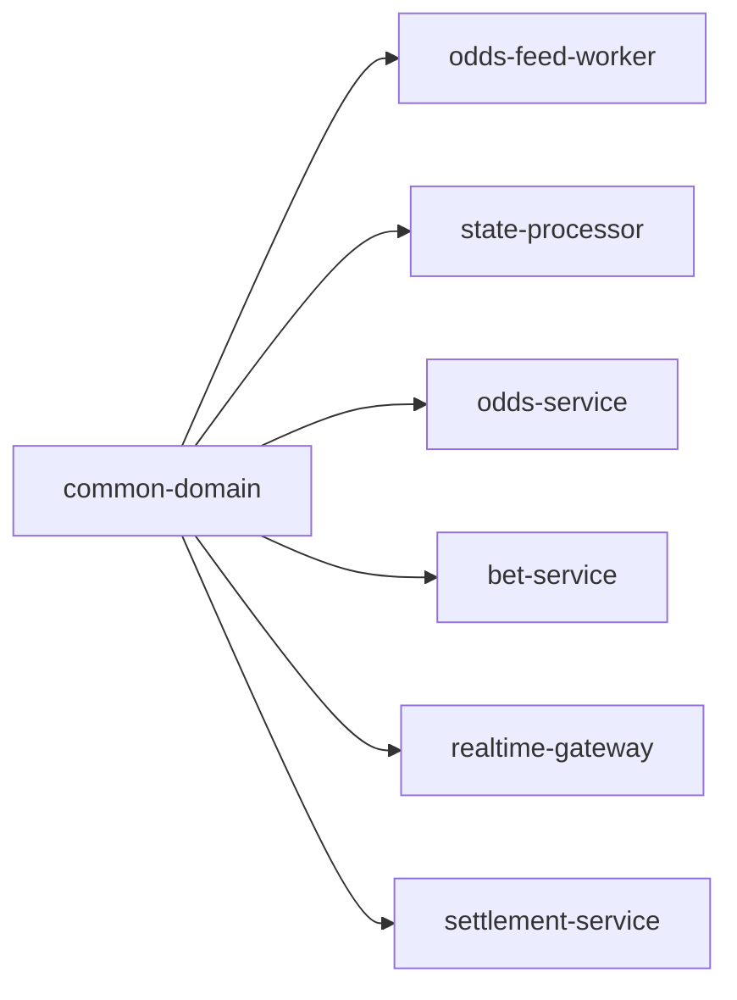

# live-sportsbook

A simplified live sports betting platform, built to practise system design and demonstrate
event-driven architecture end to end. Java 21, Maven multi-module, runnable locally.

This is a **reference project**, not a production sportsbook. It implements enough of each piece to
show the architecture honestly, including the failure modes.

```bash
docker compose up -d
./mvnw clean verify
```

---

## Table of contents

- [Architecture](#architecture)
- [Modules](#modules)
- [Technology choices and why](#technology-choices-and-why)
- [Kafka topics and partitioning](#kafka-topics-and-partitioning)
- [Redis state model](#redis-state-model)
- [The Bet Store](#the-bet-store)
- [Transactional Outbox](#transactional-outbox)
- [Bet idempotency](#bet-idempotency)
- [Settlement idempotency](#settlement-idempotency)
- [Provider failure handling](#provider-failure-handling)
- [Snapshot + Stream](#snapshot--stream)
- [Payments is a separate bounded context](#payments-is-a-separate-bounded-context)
- [Consistency trade-offs](#consistency-trade-offs)
- [Running locally](#running-locally)
- [API examples](#api-examples)
- [Observability](#observability)
- [Testing](#testing)
- [Known limitations and future improvements](#known-limitations-and-future-improvements)

---

## Architecture



The central idea is the split between **what happened** and **what is true now**:

- **Kafka** is the durable log of facts. It is the source of truth and can be replayed.
- **Redis** is a rebuildable projection of current state. Losing it is an availability problem, not
  a data-loss problem — replaying `sports-events` reconstructs it.
- **PostgreSQL** is the durable record of accepted bets. It is *not* rebuildable from Redis, and
  Kafka is not a substitute for it.

---

## Modules

| Module | Stack | Responsibility |
| --- | --- | --- |
| `common-domain` | Plain Java (no Spring, no Vert.x) | Domain events, enums, Redis key layout, shared Jackson config |
| `odds-feed-worker` | **Vert.x + RxJava 3** | Connect to provider, validate sequence, normalize, publish to `sports-events` |
| `state-processor` | Spring Boot | Consume `sports-events`, project current state into Redis, detect stale markets |
| `odds-service` | Spring Boot Web | Low-latency read path: `GET /api/v1/events/{eventId}` from Redis |
| `realtime-gateway` | **Vert.x Web** | WebSocket subscriptions, fan out `sports-events` to subscribed clients |
| `bet-service` | Spring Boot Web + JPA | `POST /api/v1/bets`, Redis validation, durable bet, transactional outbox |
| `settlement-service` | Spring Boot | Idempotent settlement on `MARKET_SETTLED`, publish `BET_SETTLED` / `PAYOUT_REQUIRED` |

`common-domain` is deliberately dependency-light so the pure Vert.x modules can use it without
dragging in Spring. The root POM is a **custom parent** that *imports* the Spring Boot and Vert.x
BOMs for version management only — the Vert.x modules inherit nothing Spring-related.

### Module dependency graph



No module depends on another service module. The only shared code is the domain contract.

---

## Technology choices and why

### Why Vert.x + RxJava for the feed worker and gateway?

Both are I/O-shaped, not logic-shaped:

- **Long-lived connections.** The feed worker holds one provider socket open indefinitely; the
  gateway holds one socket per connected client. A thread-per-connection model wastes memory at
  scale — an event loop does not.
- **High concurrent connection counts.** The gateway's job is fan-out to many sockets. This is
  precisely what a non-blocking event loop is good at.
- **Stream processing with backpressure.** The ingestion path is a pipeline:
  `parse -> validate -> sequence check -> normalize -> publish`. RxJava expresses that as a
  composed stream, and `concatMapCompletable` gives natural backpressure: a slow broker slows
  consumption of the provider stream instead of growing an unbounded in-flight set.

Neither module uses Spring Boot. Both ship as shaded executable JARs.

### Why Spring Boot for the business services?

Bet placement, settlement and the read API are *business logic over a database*, which is
Spring's home turf: declarative transactions, JPA, Bean Validation, Actuator, and a mature
ecosystem. Using Vert.x here would mean hand-rolling transaction management for no benefit.

The split is deliberate: **event-loop frameworks where I/O concurrency dominates, Spring where
business rules and transactions dominate.**

### Why Kafka?

- **Durability** — events survive consumer restarts; Redis can be rebuilt by replay.
- **Decoupling** — the feed worker does not know that three different consumers exist.
- **Multiple independent consumers** — `state-processor`, `realtime-gateway` and
  `settlement-service` each read `sports-events` at their own pace with their own offsets.
- **Replay** — a new projection can be built from history.
- **Partition ordering** — ordering guarantees per key, which is exactly the granularity we need.

### Why Redis?

Bet validation happens on the critical path of every `POST /bets`. It needs the *current* odds,
market status and event status in single-digit milliseconds. Redis gives a hash-per-market view
with O(1) field reads. Querying PostgreSQL or replaying Kafka per bet would be far slower and
would couple the hot path to the durable store.

### Why PostgreSQL for bets?

- **Transactions** — the bet row and its outbox row must commit atomically.
- **Unique constraints** — idempotency is enforced by the database, not by application checks.
- **Durability** — an accepted bet is a financial commitment.

---

## Kafka topics and partitioning

Exactly **two** topics.

### `sports-events` — facts from the sports/provider domain

`ODDS_UPDATED`, `MARKET_SUSPENDED`, `MARKET_OPENED`, `MATCH_STARTED`, `MATCH_FINISHED`,
`MARKET_SETTLED`

### `bet-events` — facts from our betting domain

`BET_PLACED`, `BET_SETTLED`, `PAYOUT_REQUIRED`

`BET_REJECTED` is deliberately **not** published. A rejected bet has no asynchronous consumer; the
client is told synchronously over HTTP. Publishing it would be noise.

### Partition keys and the trade-off

| Event | Key | Why |
| --- | --- | --- |
| `ODDS_UPDATED`, `MARKET_SUSPENDED`, `MARKET_OPENED`, `MARKET_SETTLED` | `marketId` | Market-scoped. All updates for one market land on one partition, so they stay ordered. |
| `MATCH_STARTED`, `MATCH_FINISHED` | `eventId` | Match-level; there is no market to key on. |
| `BET_PLACED`, `BET_SETTLED`, `PAYOUT_REQUIRED` | `betId` | All events for one bet stay ordered. |

**The trade-off:** keying market events on `marketId` and match events on `eventId` means events
belonging to the same *match* can land on **different partitions**, so there is **no global ordering
between a match-level event and a market-level event**. `MATCH_FINISHED` and a late
`ODDS_UPDATED` for one of its markets may be processed out of order.

We accept this because:

1. Ordering *within* a market is what actually protects correctness, and that is preserved.
2. Keying everything on `eventId` would serialize all markets of a popular match onto one
   partition, making it a hotspot — a match with many markets is exactly the high-traffic case.
3. Cross-stream ordering is handled by the **version guard**, not by partitioning: every event
   carries a monotonic `version`, and the projection ignores anything not newer than what it holds.
   Correctness therefore does not depend on arrival order.

Topics are created with 3 partitions by the `kafka-init` service in `docker-compose.yml`, so the
keying is observable rather than collapsed onto a single partition.

---

## Redis state model

Written only by `state-processor`; read by `odds-service` and `bet-service`.

```
event:{eventId}            hash   status, version, lastUpdatedAt
market:{marketId}          hash   eventId, status, version, lastUpdatedAt
market:{marketId}:odds     hash   selectionId -> odds
event:{eventId}:markets    set    marketIds of this event
markets                    set    every known marketId (for the staleness sweep)
```

`event:{eventId}:markets` lets `odds-service` assemble a full snapshot without scanning the
keyspace; `markets` lets the staleness sweep iterate without `KEYS`/`SCAN`.

### Projection rules

| Event | Effect |
| --- | --- |
| `ODDS_UPDATED` | Set `market:{id}:odds[selectionId]`. **Does not touch status.** |
| `MARKET_SUSPENDED` | `market.status = SUSPENDED` |
| `MARKET_OPENED` | `market.status = ACTIVE` |
| `MARKET_SETTLED` | `market.status = SETTLED` |
| `MATCH_STARTED` | `event.status = LIVE` |
| `MATCH_FINISHED` | `event.status = FINISHED` |

Every write is guarded: if `incoming.version <= stored.version`, the event is ignored. This makes
the projection idempotent under Kafka's at-least-once delivery.

That odds updates do not touch status matters. Given this history:

```
10:00 odds = 2.30
10:01 odds = 2.10
10:02 MARKET_SUSPENDED
10:03 odds = 1.95
10:04 MARKET_OPENED
```

current state is `odds = 1.95, status = ACTIVE` — the price kept moving while suspended, and
reopening did not resurrect a stale price.

### Why doesn't the feed worker write Redis directly?

It would be shorter, and it would be wrong. The correct flow is:

```
Provider -> Feed Worker -> Kafka -> State Processor -> Redis
```

Writing Redis from the worker would make Redis the only record of what the provider said. Kafka
would no longer be the source of truth, the projection could not be rebuilt, and no other consumer
could see the feed. Keeping Kafka in the middle is what makes Redis **disposable**.

---

## The Bet Store

PostgreSQL. One table for bets, one for the outbox, one for the settlement fence.

```
bet(id, user_id, event_id, market_id, selection_id, stake, accepted_odds,
    status, idempotency_key, created_at, settled_at, payout)
```

Indexes on `event_id`, `market_id`, `user_id`, `status`, plus a composite
`(market_id, status)` for settlement's hot query ("open bets for this market"), and a unique
constraint on `(user_id, idempotency_key)`.

Money and odds are `BigDecimal` / `NUMERIC` throughout. No doubles anywhere near money.

### Schema ownership

**`bet-service` owns all migrations** for the `sportsbook` database, including
`processed_settlements`, which `settlement-service` reads and writes but never migrates.
`settlement-service` runs with `spring.flyway.enabled: false`. One migration history, no race
between two services trying to create the same objects.

Two services mapping the same tables is a deliberate simplification. See
[Known limitations](#known-limitations-and-future-improvements).

### Could this be NoSQL?

Possibly, at much higher write scale. The access patterns are simple:

- write one bet
- look up a bet by `(userId, idempotencyKey)`
- find open bets by `(eventId, marketId)`
- update a bet's status and payout

No joins, no aggregates, and the data partitions naturally by market or user. **DynamoDB**,
**Cassandra** or **MongoDB** would all serve those patterns and scale writes horizontally.

But it is not a free swap:

- **Transactions.** The whole point of the outbox is that the bet and its event commit atomically.
  DynamoDB `TransactWriteItems` can do this within limits; Cassandra cannot offer it in the same
  form. Losing it means changing the reliability design, not just the driver.
- **Uniqueness.** `(user_id, idempotency_key)` is enforced by the database today. In Cassandra you
  would need a conditional insert (`IF NOT EXISTS`, i.e. Paxos) with a real latency cost; in
  DynamoDB a conditional put on a well-chosen key.
- **Settlement's query.** "All open bets for this market" is a straightforward index scan in
  PostgreSQL. In a key-value store it needs a deliberate secondary index or a denormalized
  market-to-bets collection kept in step.

PostgreSQL is the right starting point: it makes the guarantees explicit and cheap. Moving to NoSQL
should be driven by a measured write bottleneck, with those three problems solved on purpose —
not adopted because it sounds more scalable.

---

## Transactional Outbox

The problem being avoided:

```
save bet
COMMIT           <-- bet now exists
publish Kafka    <-- broker is down
```

The bet exists and nobody downstream knows. Settlement will never see it.

Instead:

```
BEGIN
  INSERT bet
  INSERT outbox_event      -- BET_PLACED payload
COMMIT                     -- both, or neither
```

`OutboxPublisher` then polls unpublished rows oldest-first, sends to `bet-events`, and marks them
published. Three details matter:

- The Kafka send is **synchronous** — the row is only marked published after the broker acks.
- On failure the publisher **stops at the first failed row** rather than skipping ahead, so
  ordering is preserved and the next poll retries from the same point.
- A partial index (`WHERE published_at IS NULL`) keeps the poll proportional to the backlog
  rather than to the whole table.

**This is at-least-once, not exactly-once.** A row can be published and then fail to be marked,
which republishes it. We prefer *at-least-once delivery plus idempotent consumers* over any claim
of end-to-end exactly-once semantics. Nothing in this system provides exactly-once processing.

---

## Bet idempotency

The client sends an `idempotencyKey`. A retry must never create a second bet.

Two mechanisms, because one is not enough:

1. **Read first.** If a bet already exists for `(userId, idempotencyKey)`, return it immediately.
   This happens *before* any validation — deliberately. A client retrying after a network timeout
   already holds that bet; re-validating against newer odds could reject a bet it legitimately has.
2. **Unique constraint.** Two simultaneous retries can both pass step 1. One loses the insert race
   and gets a `DataIntegrityViolationException`, which is resolved by re-reading the winner's row
   and returning that. The database, not the application, is the real fence.

### Rejection outcomes

| Outcome | HTTP | Meaning |
| --- | --- | --- |
| `ACCEPTED` | 201 | Bet is durable |
| `ODDS_CHANGED` | 422 | Price moved; response carries `currentOdds` |
| `MARKET_SUSPENDED` | 422 | Market not `ACTIVE`, or has no state |
| `EVENT_NOT_LIVE` | 422 | Event is not `LIVE` |
| `STALE_MARKET_DATA` | 422 | Market state older than the freshness threshold |
| `INVALID_REQUEST` | 400 | Validation failure or unknown selection |

422 rather than 400 for market conditions: the request was well-formed, the world moved.

---

## Settlement idempotency

Kafka can deliver `MARKET_SETTLED` more than once. Settling twice would pay twice.

```
processed_settlements(id, market_id, settlement_version, processed_at)
UNIQUE (market_id, settlement_version)
```

Settlement registers itself in that table **first**. A redelivery collides with the unique
constraint and is skipped. As with bets, the read-then-insert pattern uses the constraint as the
real fence, so two concurrent deliveries cannot both proceed.

Payout events additionally carry a **deterministic** id:

```
paymentId = betId + "-settlement-" + settlementVersion
   e.g.   bet-789-settlement-1001
```

So even if `PAYOUT_REQUIRED` reaches the payments context twice, that context can dedupe on a
stable key rather than guessing.

Settlement publishes **inside** the transaction. If the broker is unreachable the transaction rolls
back, the offset is not committed, and Kafka redelivers — so the whole settlement is retried.
Publishing after commit would be worse: the fence row would already exist, the retry would be
skipped as a duplicate, and `BET_SETTLED` would be lost permanently.

Payout arithmetic uses decimal odds, which **include** the stake:

```
payout = stake * acceptedOdds     (not stake * (odds - 1), which is profit)
```

rounded to 2 decimal places, `HALF_UP`.

---

## Provider failure handling

The dangerous failure is not a crash — it is a **silent** one. If the provider connection dies, the
last odds sit in Redis looking perfectly valid, and the system keeps accepting bets on prices that
stopped reflecting reality.

### Sequence validation

Every provider message carries a `sequenceNumber`. The worker tracks `lastProcessedSequence`:

| Condition | Action |
| --- | --- |
| `incoming <= last` | Duplicate or replay — **ignore** |
| `incoming == last + 1` | Normal — process |
| `incoming > last + 1` | **`SEQUENCE_GAP_DETECTED`** — log, request resync, still process |

A gap does not cause the message to be dropped: discarding real state on top of a gap makes things
worse. The simulated provider deliberately injects one duplicate and one gap on every cycle, so
both paths are exercised at runtime and not only in tests.

In production, `requestProviderSnapshot(...)` would fetch a snapshot or replay from the provider,
rebuild state, verify the sequence and resume. Here it logs
`PROVIDER_SNAPSHOT_REQUESTED ... note=simulated-resync`.

### Staleness → `STALE_FEED`

Two independent guards, because this is the failure that costs money:

1. **`state-processor` sweep** — every 10s, any market whose `lastUpdatedAt` is older than the
   freshness threshold (default 30s) is flipped to `SUSPENDED`, logged as
   `MARKET_SUSPENDED_STALE_FEED`. Terminal markets (`SETTLED`, `CLOSED`) are left alone.
2. **`bet-service` check** — every bet independently re-checks freshness and rejects with
   `STALE_MARKET_DATA`. It does not trust that the sweep has already run.

Defence in depth on purpose: the sweep can be late or the service restarting, and bet acceptance
must still be safe.

---

## Snapshot + Stream

A client that only subscribes to the WebSocket sees *changes* and never learns the current state.
A client that only polls REST is always behind. So:

1. **Snapshot** — `GET /api/v1/events/{eventId}` returns current state from Redis, including each
   market's `version`.
2. **Stream** — `ws://localhost:8083/api/v1/stream` delivers subsequent events.

The `version` in the snapshot is what makes the two composable: any streamed event whose `version`
is less than or equal to the snapshot's is already reflected and can be discarded. Without it, a
client cannot tell whether an arriving event is news or history.

The gateway forwards the Kafka payload **verbatim**, so clients see exactly what was published.

---

## Payments is a separate bounded context

This system **does not** implement a wallet, balances, or a ledger. Its responsibility ends at
publishing `PAYOUT_REQUIRED`.

| The betting domain knows | The payments domain knows |
| --- | --- |
| what the user bet on | user balance |
| whether the bet won | the financial ledger |
| what payout should be requested | credits and debits |
| | regulatory financial accounting |
| | duplicate-payment protection |

These are different problems with different consistency, audit and compliance requirements, and
plausibly a different team. Betting should not own the ledger. `PAYOUT_REQUIRED` with a
deterministic `paymentId` is the contract between them.

---

## Consistency trade-offs

| Boundary | Guarantee | Consequence |
| --- | --- | --- |
| Provider → Kafka | At-least-once, ordered per key | Duplicates possible; version guard absorbs them |
| Kafka → Redis | Eventually consistent | Redis lags the log by milliseconds |
| Redis → bet validation | Read of a lagging projection | A bet can be validated against odds that just changed |
| Bet + outbox | **Atomic** (one transaction) | An accepted bet always has its event |
| Outbox → Kafka | At-least-once | `BET_PLACED` may be published twice |
| Settlement | Exactly-once *effect*, at-least-once delivery | Fence table prevents double payouts |

The honest summary: **the only strong consistency in the system is inside a single PostgreSQL
transaction.** Everything else is eventually consistent, and correctness comes from version guards,
unique constraints and deterministic ids rather than from distributed transactions.

The Redis lag is a real, accepted race: odds can change between validation and acceptance. This is
mitigated, not eliminated — the client sends `expectedOdds`, and any drift rejects the bet with
`ODDS_CHANGED`. A sportsbook that needed a stronger guarantee would have to serialize acceptance
per market, at a significant throughput cost.

---

## Running locally

### Prerequisites

Java 21 and Docker. **No Maven installation needed** — use the wrapper.

There are two ways to run it: everything in Docker, or infrastructure in Docker with the services
on your host. Both use the same `docker-compose.yml`.

### Option A — everything in Docker

```bash
./mvnw clean package          # build the service JARs
docker compose up -d --build  # infrastructure, all six services, the provider simulator, and the demo UI
```

Then open **<http://localhost:8080>**.

Nothing runs until you start it: press **Start match** in the dev panel, and the simulator streams
that match through the feed worker, the projection fills, and a bet on it settles when you press
**Finish & settle**. For a looping scripted match in the background instead, set
`FEED_AUTOPLAY: "true"` on `provider-simulator`, or start it once with
`curl -X POST localhost:8080/dev/scripted/start` (it runs as `event-123`, which the curl examples
below use). Ports `8081`–`8085`, `9092`, `6379` and `5432` are
published to the host, so the curl and WebSocket examples below work unchanged.

#### The demo UI

A single static page (`ui/index.html`, no build step and no framework) served by nginx, which also
reverse-proxies `/api/*` to the services. One origin, so the browser makes no cross-origin request
and neither Spring service needs CORS configuration.

It exists to make the SNAPSHOT + STREAM pattern visible rather than to be a real client:

- loads the REST snapshot, then subscribes over WebSocket, exactly as a real client should
- applies **the same version guard the server applies** — streamed events not strictly newer than
  local state are logged as `ignored` instead of being applied, which is the reconciliation rule
  the `version` field exists for
- flashes odds green or red as they move, and disables **Bet** unless the event is `LIVE` and the
  market `ACTIVE`
- sends the displayed odds as `expectedOdds`, so a price moving first produces a real
  `ODDS_CHANGED` rejection
- *Retry last* reuses the previous `idempotencyKey`, so the server returns the same `betId` rather
  than creating a second bet

A dev-panel match stays bettable until you settle it. The optional scripted match is different:
it settles every ~20s and its market is only `ACTIVE` between `MARKET_OPENED` and
`MATCH_FINISHED`; raise `PROVIDER_INTERVAL_MS` on `provider-simulator` to widen that window.

```bash
docker compose ps                                  # health of every service
docker compose logs -f odds-feed-worker            # follow one service
docker compose up -d --build bet-service           # rebuild one after a code change
docker compose down -v                             # stop and wipe the database volume
```

The images run pre-built JARs rather than compiling from source, so **re-run `./mvnw package`
before `--build`** after changing code.

Startup order is enforced by health checks, not by luck: `settlement-service` waits for
`bet-service` to report healthy (it owns the Flyway migrations and settlement runs with Flyway
disabled), and `odds-feed-worker` waits for the consumers so no events are missed.

### Option B — infrastructure in Docker, services on the host

Useful when running services from an IDE or with `spring-boot:run`.

```bash
docker compose up -d kafka kafka-init redis postgres
./mvnw clean verify
```

Kafka (KRaft, no ZooKeeper) on `9092`, Redis on `6379`, PostgreSQL on `5432`
(database/user/password all `sportsbook`). The `kafka-init` service creates both topics with 3
partitions and exits.

> **Two Kafka listeners.** A broker advertises one address per listener, and `localhost:9092` is
> unreachable from another container while `kafka:19092` is unreachable from the host. So the broker
> exposes both: `HOST://localhost:9092` for processes on your machine and `DOCKER://kafka:19092` for
> containers. Nothing needs to change when switching between the two options — each side already
> points at the right one.

#### Starting the services on the host

Each in its own terminal. Every service runs from its built JAR, Spring Boot and Vert.x alike:

```bash
java -jar state-processor/target/state-processor-1.0.0-SNAPSHOT.jar         # :8081
java -jar odds-service/target/odds-service-1.0.0-SNAPSHOT.jar              # :8082
java -jar realtime-gateway/target/realtime-gateway-1.0.0-SNAPSHOT.jar      # :8083
java -jar bet-service/target/bet-service-1.0.0-SNAPSHOT.jar                # :8084  (runs Flyway)
java -jar settlement-service/target/settlement-service-1.0.0-SNAPSHOT.jar  # :8085
java -jar provider-simulator/target/provider-simulator-1.0.0-SNAPSHOT.jar  # :8086  (dev only)
java -jar odds-feed-worker/target/odds-feed-worker-1.0.0-SNAPSHOT.jar      # no HTTP port
```

Start `bet-service` at least once before `settlement-service`: it owns the migrations, and
settlement runs with Flyway disabled.

Start `odds-feed-worker` **last**, so the consumers are already listening when events start
flowing. (They would catch up anyway — `state-processor` and `settlement-service` read from
`earliest` — but the gateway streams live only.)

`provider-simulator` stands in for the external provider. The worker dials it at
`ws://localhost:8086/provider/stream` (its `PROVIDER_URL` default) and reconnects with backoff, so
the two can start in either order. The simulator also serves the `/dev/*` control API on the same
port, so on the host the dev panel endpoints are `http://localhost:8086/dev/matches` and so on.

#### Alternative: `spring-boot:run`

For the Spring services, `spring-boot:run` gives the usual development conveniences. It needs the
modules in the local repository first, and it must be run **without `-am`**:

```bash
./mvnw clean install -DskipTests          # once
./mvnw -pl odds-service spring-boot:run
```

> **Why not `-am`?** `./mvnw -pl odds-service -am spring-boot:run` fails with
> *"Unable to find a suitable main class"*. A goal invoked from the command line runs against
> every project in the reactor, and `-am` pulls in the root aggregator and `common-domain`, neither
> of which has a main class. Dropping `-am` restricts the reactor to the one module — which is why
> the `install` step above is needed to supply `common-domain`.

Once connected, the feed worker streams whatever the simulator emits. Start a match from the dev
panel (`POST /dev/matches`) or the scripted loop (`POST /dev/scripted/start`); settling it ends in
`MARKET_SETTLED`, which triggers settlement.

### Useful Maven commands

```bash
./mvnw clean verify                          # everything, including integration tests
./mvnw test                                  # unit tests only
./mvnw clean package                         # build all artifacts
./mvnw clean install -DskipTests             # publish modules to the local repo
./mvnw -pl bet-service -am test              # one module plus its dependencies
./mvnw -pl odds-feed-worker -am package      # build one executable JAR
```

### Configuration

All services read environment variables, with local defaults:

| Variable | Default |
| --- | --- |
| `KAFKA_BOOTSTRAP_SERVERS` | `localhost:9092` |
| `REDIS_HOST` / `REDIS_PORT` | `localhost` / `6379` |
| `DB_URL` | `jdbc:postgresql://localhost:5432/sportsbook` |
| `DB_USERNAME` / `DB_PASSWORD` | `sportsbook` / `sportsbook` |
| `SPORTS_EVENTS_TOPIC` | `sports-events` |
| `BET_EVENTS_TOPIC` | `bet-events` |
| `PROVIDER_URL` (feed worker) | `ws://localhost:8086/provider/stream` |
| `PROVIDER_CONNECT_TIMEOUT_MS` (feed worker) | `5000` |
| `PROVIDER_RECONNECT_INITIAL_MS` / `PROVIDER_RECONNECT_MAX_MS` (feed worker) | `500` / `30000` |
| `SIMULATOR_PORT` (simulator) | `8086` |
| `PROVIDER_INTERVAL_MS` (simulator) | `2000` |
| `FEED_AUTOPLAY` (simulator) | `false` — nothing runs until started from the dev panel; `true` loops the scripted match |
| `SIMULATOR_SEQUENCE_FILE` (simulator) | `.provider-simulator-sequence` — the persisted sequence reservation (`/data/sequence` in Docker) |

---

## API examples

### Snapshot

```bash
curl -s http://localhost:8082/api/v1/events/event-123 | jq
```

```json
{
  "eventId": "event-123",
  "status": "LIVE",
  "markets": [
    {
      "marketId": "market-456",
      "status": "ACTIVE",
      "version": 1003,
      "lastUpdatedAt": "2026-09-26T10:15:30Z",
      "selections": [
        { "selectionId": "draw", "odds": 3.40 },
        { "selectionId": "real-madrid", "odds": 2.10 }
      ]
    }
  ]
}
```

### WebSocket stream

```bash
# websocat, wscat, or any WebSocket client
websocat ws://localhost:8083/api/v1/stream
```

Send:

```json
{"action":"SUBSCRIBE","eventId":"event-123"}
```

Receive the acknowledgement, then live events:

```json
{"action":"SUBSCRIBED","eventId":"event-123"}
{"type":"ODDS_UPDATED","eventId":"event-123","marketId":"market-456","selectionId":"real-madrid","odds":1.95,"version":1004,"timestamp":"2026-09-26T10:15:31Z"}
{"type":"MARKET_SUSPENDED","eventId":"event-123","marketId":"market-456","version":1005,"timestamp":"2026-09-26T10:15:33Z"}
```

Unsubscribe with `{"action":"UNSUBSCRIBE","eventId":"event-123"}`. Events are delivered **only** to
sockets subscribed to that `eventId`.

### Place a bet

```bash
curl -s -X POST http://localhost:8084/api/v1/bets \
  -H 'Content-Type: application/json' \
  -d '{
        "userId": "user-42",
        "eventId": "event-123",
        "marketId": "market-456",
        "selectionId": "real-madrid",
        "stake": 100.00,
        "expectedOdds": 2.10,
        "idempotencyKey": "demo-request-1"
      }' | jq
```

Accepted (`201`):

```json
{ "betId": "…", "status": "ACCEPTED", "acceptedOdds": 2.10 }
```

Rejected (`422`):

```json
{ "status": "ODDS_CHANGED", "currentOdds": 1.95, "reason": "Odds moved before the bet was accepted" }
```

Re-running the same command with the same `idempotencyKey` returns the **same `betId`** and creates
no second bet.

### Example Kafka events

`sports-events`:

```json
{"type":"ODDS_UPDATED","eventId":"event-123","marketId":"market-456","selectionId":"real-madrid","odds":2.10,"version":1001,"timestamp":"2026-09-26T10:15:30Z"}
{"type":"MARKET_SETTLED","eventId":"event-123","marketId":"market-456","winningSelectionId":"real-madrid","version":1006,"timestamp":"2026-09-26T10:16:00Z"}
```

`bet-events`:

```json
{"type":"BET_PLACED","betId":"bet-789","userId":"user-42","eventId":"event-123","marketId":"market-456","selectionId":"real-madrid","stake":100.00,"odds":2.10,"timestamp":"…"}
{"type":"BET_SETTLED","betId":"bet-789","status":"WON","payout":210.00,"timestamp":"…"}
{"type":"PAYOUT_REQUIRED","paymentId":"bet-789-settlement-1006","betId":"bet-789","userId":"user-42","amount":210.00,"currency":"EUR","timestamp":"…"}
```

Read a topic directly:

```bash
docker exec -it sportsbook-kafka /opt/kafka/bin/kafka-console-consumer.sh \
  --bootstrap-server localhost:9092 --topic sports-events --from-beginning
```

---

## Observability

Spring services expose Actuator at `/actuator/health`, `/actuator/metrics`.

| Metric | Where |
| --- | --- |
| `sports_events_processed_total`, `sports_events_ignored_total` | state-processor |
| `markets_suspended_stale_total` | state-processor |
| `bets_accepted_total`, `bets_rejected_total`, `bet_acceptance_latency` | bet-service |
| `bets_duplicate_requests_total` | bet-service |
| `outbox_events_published_total`, `outbox_publish_failures_total` | bet-service |
| `settlements_processed_total`, `duplicate_settlements_total` | settlement-service |

The Vert.x modules have no Actuator; they keep plain counters and log a snapshot every 30s
(`odds_feed_messages_received_total`, `odds_feed_sequence_gaps_total`, `websocket_connections`,
`websocket_messages_sent_total`, …).

Logs use stable, greppable event names with identifiers attached:
`SEQUENCE_GAP_DETECTED`, `MARKET_SUSPENDED_STALE_FEED`, `BET_ACCEPTED`,
`BET_REJECTED_ODDS_CHANGED`, `BET_REJECTED_STALE_MARKET`, `DUPLICATE_BET_REQUEST`,
`SETTLEMENT_STARTED`, `SETTLEMENT_COMPLETED`, `DUPLICATE_SETTLEMENT_SKIPPED`.

---

## Testing

```bash
./mvnw clean verify
```

141 tests: 134 unit tests (JUnit 5, AssertJ, Mockito) plus 7 Testcontainers integration tests.

| Module | Coverage |
| --- | --- |
| `common-domain` | Event JSON round-trips, discriminators, partition keys, decimal scale |
| `odds-feed-worker` | Sequence validation (duplicate/gap/reset), normalization, reconnect backoff, resume cursor |
| `provider-simulator` | Feed sequencing, duplicate/gap injection, scripted match lifecycle, custom match ids, replay window, restart-safe sequence reservation, auto-drift timing and lease (virtual time) |
| `state-processor` | Version guard, all projection rules, stale/duplicate rejection |
| `odds-service` | Snapshot assembly, 404 handling, HTTP contract |
| `bet-service` | Every rejection path, idempotent replay, insert race, outbox write |
| `realtime-gateway` | Subscription registry, targeted delivery, disconnect cleanup, frame parsing |
| `settlement-service` | WON/LOST, payout maths, duplicate settlement, deterministic payout id |

Integration tests:

- **`SportsEventProjectionIT`** — Kafka → state-processor → Redis, including that an older version
  does not rewind the projection.
- **`PlaceBetIT`** — `POST /bets` → Postgres bet row → outbox row → `BET_PLACED` on `bet-events`,
  plus idempotent retry and rejection. Runs the real Flyway migration.

Both are annotated `@Testcontainers(disabledWithoutDocker = true)`, so `./mvnw clean verify`
succeeds with or without a Docker daemon — it simply skips them when Docker is absent.

> **Docker Engine 29 note.** Docker 29 raised its minimum API version to 1.40, while the
> docker-java client bundled with Testcontainers 1.21.3 negotiates v1.32 and is rejected with
> HTTP 400. The root POM therefore pins `api.version` via `docker.api.version` (default `1.44`).
> On an older daemon, override it: `./mvnw verify -Ddocker.api.version=1.40`.

---

## Known limitations and future improvements

Honest list. None of these are hidden behind optimistic wording.

1. **Two services map the same tables.** `settlement-service` reads and writes `bet` directly,
   which is a shared-database coupling. It works here and keeps the project understandable, but in
   a system where these deploy independently the bet store should sit behind its owning service's
   API, or settlement should own its own projection.
2. **Redis validation is racy by construction.** Odds can change between validation and insert.
   `expectedOdds` mitigates it; only per-market serialization would eliminate it, at a throughput
   cost we chose not to pay.
3. **The outbox publisher is a single poller.** Two `bet-service` instances would both poll and
   could publish the same row twice. Consumers are idempotent so this is safe, but
   `SELECT … FOR UPDATE SKIP LOCKED` would make it cleaner, and CDC (Debezium) would remove the
   polling entirely.
4. **Provider recovery is replay-only.** A reconnecting or restarted worker resumes from a cursor
   (`?fromSequence=`) and the provider replays from a bounded window. A disconnect longer than that
   window still leaves a gap, and `requestProviderSnapshot(...)` only logs: real recovery for that
   case needs the provider's snapshot API and state reconciliation.
5. **No authentication or authorization.** Any caller can place a bet as any `userId`. A real
   system needs authn, per-user limits, and stake/liability checks.
6. **No consumer retry or dead-letter topics.** An unparseable record is logged and skipped so it
   cannot block a partition, but there is no DLQ and no backoff policy.
7. **No `VOID` path.** `BetStatus.VOID` exists but nothing produces it. Real sportsbooks void bets
   on abandoned matches, palpable errors and market corrections.
8. **Single-node infrastructure.** Replication factor 1 everywhere. Fine for a laptop; a real
   deployment needs replicated Kafka and Postgres with failover.
9. **One hardcoded demo event.** The simulated provider drives a single match. Multi-match load
   would be needed to exercise partition hotspots meaningfully.
10. **Settlement does not page.** It loads all open bets for a market into memory. A market with
    millions of open bets would need batching.
